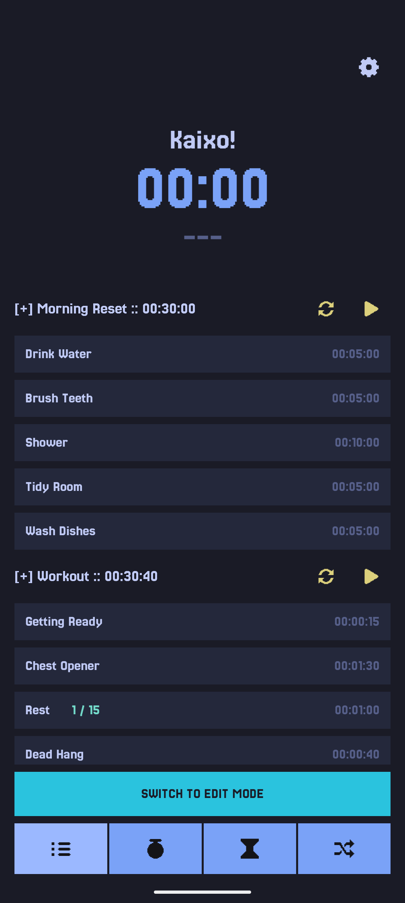
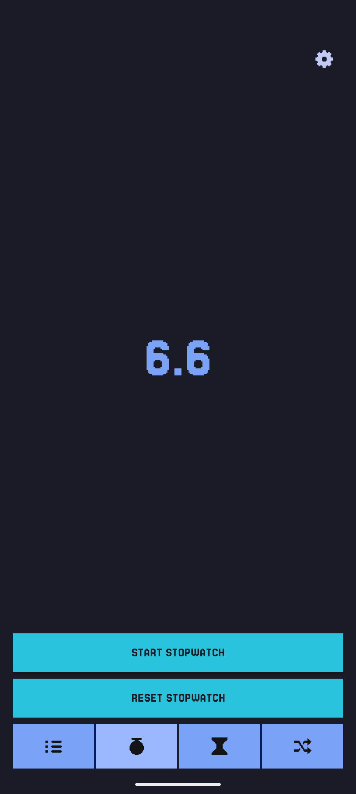
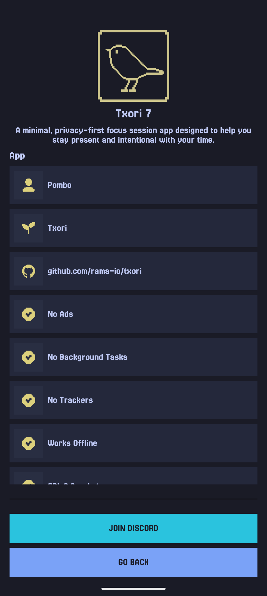

# Txori

**Txori** is a minimal, privacy-first focus session app designed to help you stay present and
intentional with your time.

Built entirely in **native Kotlin**, Txori runs fully **on-device**, avoids tracking, no internet
access, and no external APIs.

---

## Screenshots

| Focus | Stopwatch | About |
| - | - | - |
|  |  |  |

---

## Features

- **Focus sessions**: Start simple sessions to dedicate time to a task without distractions.
- **Timer**: Set countdown timers for structured work or breaks.
- **Stopwatch**: Measure time freely for any activity.

### Roulette

Roulette rotates through a custom list of activities at a timer interval you choose.

It's ideal for encouraging movement and healthy habits during long work sessions. Create lists tailored to your environment, whether you're in an office, working from home, studying, or exercising.

Example activities include:
- Drink water
- Check your posture
- Stand up and stretch
- Look away from the screen
- Do a few push-ups
- Do a few squats

The goal is to keep you moving and mindful throughout the day without disrupting your focus.

---

## Installation

  
  &nbsp;
  
  &nbsp;
  

---

## License

**Txori** is Free Software. You are free to use, study, share, and improve it under the terms of the
**GNU General Public License v3** or later.

---

## Tests

### Focus Group

| Device | Version | Start/Pause Tasks | Skip Task | Add 30s Timer | Reload Task | Add Task | Add Group |
| - | - | - | - | - | - | - | - |
| Pixel 9 Pro Fold | Android 16 / API 36 | Y | Y | Y | Y | Y | Y |
| Nexus 5 | Android 5 / API 21 | Y | Y | Y | Y | Y | Y |

### Stopwatch and Timer

| Device | Version | Start/Pause Stopwatch | Reset Stopwatch | Start/Pause Timer | Reset timer | Edit Timer |
| - | - | - | - | - | - | - |
| Pixel 9 Pro Fold | Android 16 / API 36 | Y | Y | Y | Y | Y |
| Nexus 5 | Android 5 / API 21 | Y | Y | Y | Y | Y |

### Roulette

| Device | Version | Start/Pause Roulette | Skip Roulette Task | Finish Roulette | Edit Roulette Timer |
| - | - | - | - | - | - |
| Pixel 9 Pro Fold | Android 16 / API 36 | Y | Y | Y | Y |
| Nexus 5 | Android 5 / API 21 | Y | Y | Y | Y |

---

## Documents

- [Branding](./docs/branding.md)
- [Attributions](./docs/attributions.md)
